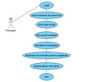
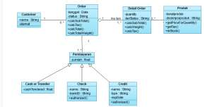
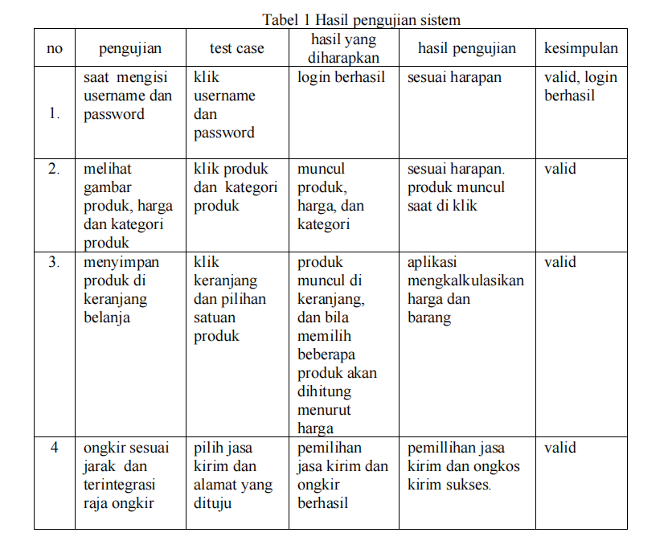

# **Tugas KPPL E Week 3**
Resume paper yang menggunakan model proses dalam membangun perangkat lunak.

Nama: Adyuta Prajahita Murdianto

NRP: 5025221186

Kelas: KPPL E

## **Judul** 

PENERAPAN METODE WATERFALL PADA APLIKASI TOKO ONLINE BIMA KIRANA CIBITUNG

## **Link Paper** 

[(https://ejurnal.provisi.ac.id/index.php/JTIKP/article/download/283/237)](https://ejurnal.provisi.ac.id/index.php/JTIKP/article/download/283/237)

## **Deskripsi Perangkat Lunak**

Aplikasi yang dikembangkan adalah aplikasi toko online untuk membantu toko Bima Kirana Cibitung menjangkau lebih banyak pelanggan dengan cara menyediakan media transaksi berbasis aplikasi. Aplikasi ini dibangun menggunakan framework CodeIgniter dan database MySQL.

## **Model**

Aplikasi ini menggunakan model proses Waterfall. Model waterfall merupakan model pengembangan sistem informasi yang sistematik dan sekuensial. Model waterwall juga merupakan model proses perangkat lunak yang melibatkan tahapan pengembangan terpisah: spesifikasi, desain, implementasi, pengujian, dan pemeliharaan. Pada prinsipnya, satu tahap harus diselesaikan sebelum maju ke tahap berikutnya.

## **Spesifikasi**

- Toko memajang barang di etalase toko, memasang harga barang dan diskon yang diberikan.
- Pelanggan memilih barang kemudian melakukan pembayaran di kasir.
- Kasir menyerahkan barang ke pelanggan.

## **Tahapan Aktivitas**

**Requirements analysis and definition**

Pertama, penulis menganalisis kebutuhan dari sistem, yakni dengan cara melakukan wawancara dengan pemiliki toko untuk mengetahui apa saja yang bisa dilakukan oleh aplikasi sesuai keinginan pemilik toko.

**System and software design**

Penulis mendesain aplikasi menggunakan bantuan tool UML. Pertama, penulis mendesain alur bisnis yang akan dilakukan (Use Case Diagram). Selanjutnya, penulis mendesain rancangan sistem yang akan di develop (Class Diagram).

**Implementation**

Pada tahap ini penulis mulai mengimplementasikan rancangan desain yang telah dibuat menjadi bahasa pemrograman. Penulis memilih PHP sebagai bahasa pemrogramannya dan Codeigniter sebagai framework dari bahasa pemrogramannya.

**Integration and system testing**

Setelah penulis menyelesaikan pengembangan dari aplikasi, penulis juga melakukan testing terhadap aplikasi tersebut. Disini penulis menggunakan metode Blackbox untuk pengujiannya.

**Operation and maintenance**

Ditahap ini penulis memesankan web hosting untuk aplikasi dan melakukan pemeliharaan aplikasi.

## **Desain**

**Use Case Diagram**

**ClassDiagram**

## **Validation and Testing**

Untuk menguji aplikasinya, penulis menggunakan metode Blackbox. Blackbox Testing adalah metode pengujian yang memperlakukan sistem sebagai "kotak hitam" (blackbox) yang tidak dapat dilihat atau diakses secara internal. Tujuan dari metode ini adalah untuk memastikan bahwa sistem berfungsi dengan benar dan menghasilkan output yang diharapkan berdasarkan input yang diberikan. Berikut hasil testing yang dilakukan oleh penulis,

## **Evolution**

Penulis belum mencantumkan gambaran mengenai pengembangan aplikasi untuk kedepannya. Namun, apliksai bisa dikembangkan secala berkala sesuai permintaan dari user dikemudian hari.
